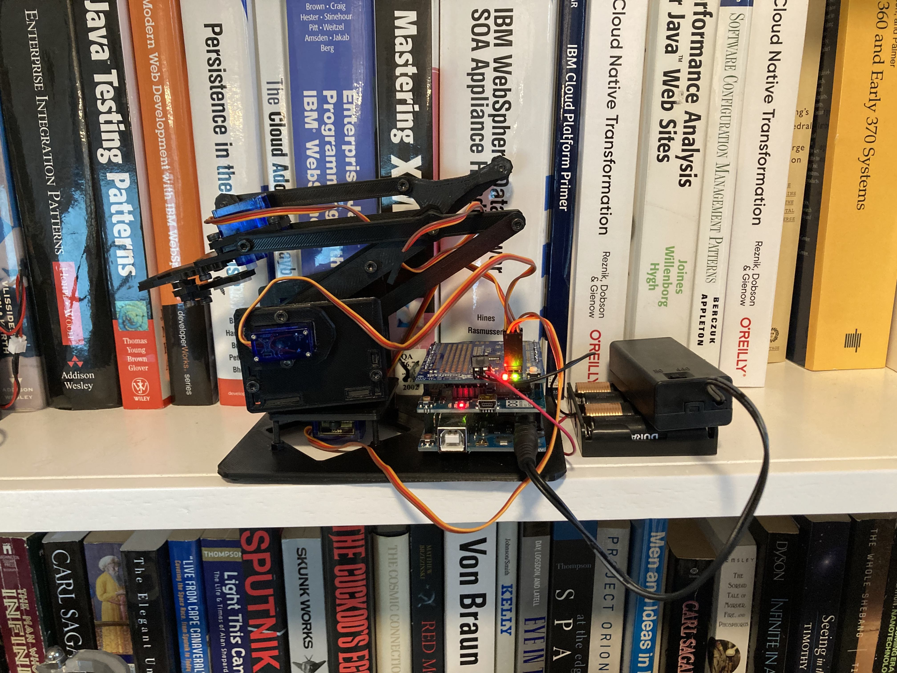

# MeArmSoftware
Arduino software for the MeArm robot arm (using an Arduino Wifi Shield and AdaFruit PWM Servo Board)

One of the frustrations of using the open source [MeArm robot arm](https://www.thingiverse.com/thing:360108) is the lack of support of software for Arduino -- the community as a whole seems to have gravitated toward Raspberry Pi as the default choice for controlling the MeArm -- however for the last several months Raspberry Pis have been as scarce as hens teeth (there are literally sniping bots donated by the community that grab them off of sites like Amazon and Adafruit as soon as they appear in the online catalogs as available).  Meanwhile, Arduinos are readily available, but the Arduino community itself has fractured and spread, with the result being that there are literally dozens of boards, form factors, software libraries, and combinations of these.

I have been trying for several weeks to put together a simple REST-based server for the boards that I had either on hand or available - a standard [Arduino Uno Rev3](https://store-usa.arduino.cc/products/arduino-uno-rev3), an [Arduino Wifi Shield](https://www.sparkfun.com/products/retired/11287) and the [Adafruit PWM Servo shield](https://www.adafruit.com/product/1411?gclid=Cj0KCQiA7bucBhCeARIsAIOwr--_LZ_OsnZebVt89jlr0gecEERaLyTYsC1oAsb4bOj-4omWjSup22YaAlG3EALw_wcB)

I finally managed to pull it all together - along the way also trying other combinations that I will eventually post into this repository, including replacing the Arduino Uno and Wifi Shield with the currently supported [Arduino Uno Wifi Rev 2](https://store.arduino.cc/products/arduino-uno-wifi-rev2) (which, of course, uses a different chipset, and thus an entirely different set of software libraries from the previous version).

The project was built using libraries and resources from several sources.  The most notable include

- aREST - the REST library for Arduino by Marco Schwartz (https://github.com/marcoschwartz/aREST)
- The Arduino PWM library for the Adafruit PWM servo shield

Both of these will need to be installed in your Arduino IDE through the library manager before you begin.

**Using the software**

Simply open the .ino file in the Arduino IDE (either the web version or the isntallable version), edit the file to include your Wifi SSID and password, select the right board type (Arduino Uno) and port and upload the file.  You probably want to initially start using the USB cable from your computer to power the Arduino so that you can also use the Serial Monitor to read the IP address that the Arduino Wifi Shield comes up on.  This will be reported by the `printWifiStatus()` function that runs at `setup()` time (both when the board is powered up and whenever you press the reset button).

Once you know the IP address you can simply type that IP address into a browser connected to the same wifi network to read off the current positions of the base, gripper, and x and y servos (returned as a JSON response).

You can move the individual servos (or return to home position) by sending REST commands to the same IP address (in the examples below INT is an integer between 0 and 180).  The supported commands are:

- http://your.ip.address.here/openGripper
- http://your.ip.address.here/closeGripper
- http://your.ip.address.here/baseRotate?param=INT
- http://your.ip.address.here/xExtend?param=INT
- http://your.ip.address.here/yExtend?param=INT
- http://your.ip.address.here/home

**Tweaking the operation**

Each build of the MeArm is different, with different placement and travel of the servos.  You will need to play with the range of motion on each servo and tweak the fixed parameters for the upper and lower ranges of the four servos (BASE_SERVOMIN, BASE_SERVOMAX, GRIPPER_SERVOMIN, GRIPPER_SERVOMAX, XSERVOMIN, XSERVOMAX, YSERVOMIN, and YSERVOMAX).  These parameters are supposedly from 0 to 4096, but in practice I've only seen them vary between 10 and 400.
